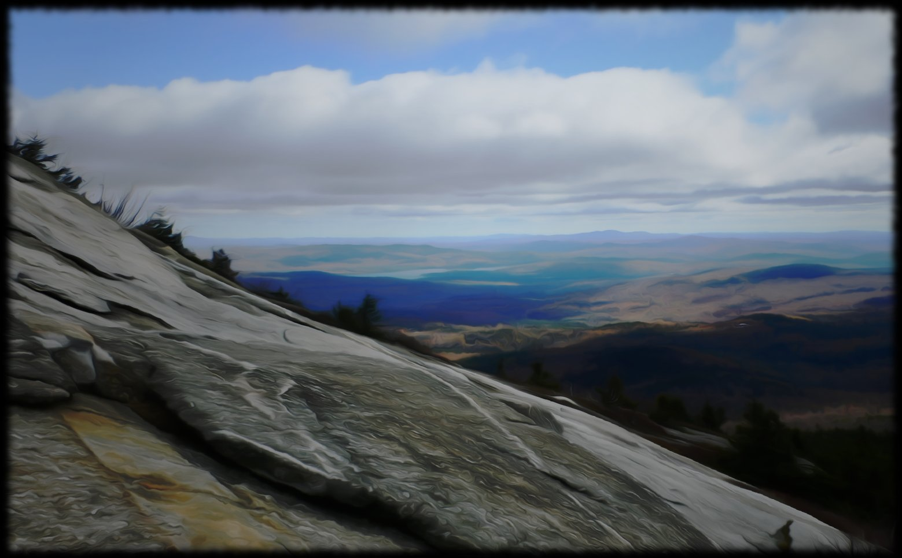

class: middle center

### *title*

*sub*

.space[.]

George Matthews, Pennsylvania College of Technology

*2020*

.note[press "h" for help on keyboard controls]

---
layout: true

## title

---

--

point

--

point

---
layout: false
### find out more

---
class: bottom center credits

.credit-image[

]

.space[.]

#### Credits

*Built with:*

[Rstudio](https://rstudio.com/products/rstudio/) 
 
[xarignan](https://github.com/yihui/xaringan) html presentation framework 

*Images by:*
Image by <a href="https://pixabay.com/users/AbsolutVision-6158753/?utm_source=link-attribution&amp;utm_medium=referral&amp;utm_campaign=image&amp;utm_content=2654084">Gino Crescoli</a>, <a href="https://pixabay.com/users/JonasKIM-7133458/?utm_source=link-attribution&amp;utm_medium=referral&amp;utm_campaign=image&amp;utm_content=3233392">Jonas KIM</a>, and <a href="https://pixabay.com/users/aitoff-388338/?utm_source=link-attribution&amp;utm_medium=referral&amp;utm_campaign=image&amp;utm_content=1822040">Andrew Martin</a> from <a href="https://pixabay.com/?utm_source=link-attribution&amp;utm_medium=referral&amp;utm_campaign=image&amp;utm_content=1822040">Pixabay</a>

**For more slideshows visit:**

[ethics slideshows home page](https://gwmatthews.github.io/ethics-slideshows/index.html)

[or get the source code](https://github.com/gwmatthews/ethics-slideshows) 

