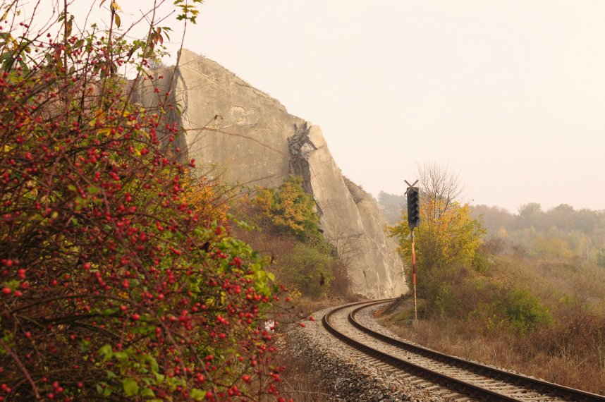

---
output:
  xaringan::moon_reader:
    seal: false
    css: [default, "my-style.css"]
    lib_dir: libs
    nature:
      countIncrementalSlides: false
---
class: inverse, middle, center

### *philosophical ethics*

*an introduction*

.center[]

George Matthews, Pennsylvania College of Technology

.credits[ BY-SA, 2019]

---
background-color: #ccc

### the case of the runaway trolley

.dark-gray-box[

- You are standing near a switch next a railroad track when you notice a runaway trolley coming down the tracks in your direction.

- There are five children playing on the track below too far away to hear you.

- There is one worker on the other track where the traincar would go if you threw the switch.
]

  

--

- *Would* you throw the switch?

--

- *Should* you throw the switch?

--

- **WHY?**

---
class: inverse 

### descriptive ethics

--

- How do people actually respond to ethical dilemmas?

--

- What psychological and sociological explanations account for our ethical thinking and behavior?

--

- How might ethical thinking and bahavior vary with circumstances, upbringing, culture or education?

--

  

.light-gray-box[

- Cases like the runaway trolley have been studied extensively by moral psychologists.
 
- **One result**: most people say they would throw the switch.

]

---
class: inverse

### prescriptive ethics

--

- How *should* we respond to ethical dilemmas and problems?

--

- What justifications are there for our moral claims and assumptions?

--

- How can we use critical rationality to establish ethical norms?

--

  

.light-gray-box[
- Many of us assume that the consequences of our actions determine their rightness or wrongness.
 
- Is this a correct assumption? Do better consequences *really* make an act morally right?
]

---
background-color: #ccc

### another runaway trolley

.dark-gray-box[

- You are standing on a bridge over a railroad track railroad when you notice a runaway trolley coming down the tracks in your direction.

- There are five children playing on the track below too far away to hear you.

- There is a rather large person next to you and if you push him in front of the trolley it will stop the trolley but kill him.
]

  

--

- Most people would **not** push the person off the bridge to save the children.

--

- Why not, given that the consequences are the same in this case and the last?

---
class: inverse

### meta-ethics

--

- How do ethical language and thinking differ frome other ways of speaking or thinking?

--

- Are ethical claims about the facts, are they opinions or are they something else entirely?

--

- Is there any hope for rationally settling conflicts in ethics?

--

  

.light-gray-box[

- When we claim that it is acceptable to throw the switch, but not to push the person off of the bridge are we making a statement about a fact?
 
- Or are we merely expressing an opinion?

- Or are we doing something else and *what exactly might that be?*
]

---
layout: true
class: double
background-color: #ccc
### elements of philosophical ethics
---

.dark-gray-box[1. .red[Appeal to reason]

2. Attempt at universality

3. Commitment to impartiality

4. Insistence on overriding character of ethical principles]

  

Philosophers trust reason as a method of discovering truth and producing genuine conviction.

---

.dark-gray-box[1. Appeal to reason

2. .red[Attempt at universality]

3. Commitment to impartiality

4. Insistence on overriding character of ethical principles]

  

Ethics aspires to find principles that transcend individual cases and apply to all relevantly similar situations.

---

.dark-gray-box[1. Appeal to reason

2. Attempt at universality

3. .red[Commitment to impartiality]

4. Insistence on overriding character of ethical principles]

  

Right and wrong shouldn't depend on who you are.

---

.dark-gray-box[1. Appeal to reason

2. Attempt at universality

3. Commitment to impartiality

4. .red[Insistence on overriding character of ethical principles]
]

  

If ethics is about what is fundamentally right and wrong it overrides preference, customs and convenience.

---
layout: false
layout: true
class: inverse, double
### our plan of attack

---
.left-column[

### .red[logic]

]

.right-column[

Before anything else we need to know something about toolkit used by philosophers -- the critical assessment of arguments and the ways in which we often get things wrong in reasoning.

.center[]
]

---
.left-column[

### .gray[logic]

### .red[ethical theory]

]

.right-column[

Next we consider various approaches to spelling out the nature of ethics. This will involve examining the relationship between ethics, culture, religion, self-interest as well as the possibility of basing ethical norms on our capacity to think for ourselves.

.center[]
]

---
.left-column[

### .gray[logic]

### .gray[ethical theory]

### .red[applied ethics]

]

.right-column[

Finally we see how all of this plays out in the real world. Here we will examine many particular cases where values are at stake.

.center[]
]

---
layout: false
class: double
background-color: #ccc
### find out more

.dark-gray-box[
- [The Trolley Problem](https://www.theguardian.com/science/head-quarters/2016/dec/12/the-trolley-problem-would-you-kill-one-person-to-save-many-others)

- [Socrates on self-confidence](https://youtu.be/_gVyEOefhIQ) and questioning others about their values. A great video outlining the motivation for doing philosophy in the first place.

- Ethics, ed. George Matthews. A free textbook -- coming soon!]

---
class: inverse, bottom, right, credits

**Credits**

*Built with:*

[Rstudio](https://rstudio.com/products/rstudio/) 

[xarignan](https://github.com/yihui/xaringan) html presentation framework 

*Photos by:*

James Matthews 

*Source code:*

[GitHub](https://github.com/gwmatthews/ethics-slideshows) 

