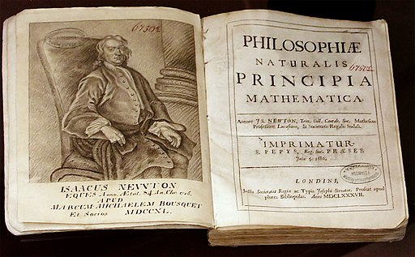

---
output:
  xaringan::moon_reader:
    seal: false
    css: [default, "my-style.css"]
    lib_dir: libs
    nature:
      countIncrementalSlides: false
      beforeInit: macros.js
---
class: inverse, middle, center

### *a little logic*

*arguments, reasoning and proof*

.inv[.]

.inv[.]

George Matthews, Pennsylvania College of Technology

*2019*

.inv[.]

.note[press "h" for help on keyboard controls]
---
layout: true
class: inverse

### *What do I know?*

.inv[.]

---

.left-column[

#### .lightgray[Knowledge is]

#### .darkgray[justified,]

#### .darkgray[true.]

#### .darkgray[belief.]

]

.right-column[

]

---

.left-column[

#### .lightgray[Knowledge is]

#### .darkgray[justified,]

#### .darkgray[true.]

#### .red[belief.]

]

.right-column[

.example[

- How can we know anything at all? This ancient philosophical question has troubled many people.

- First, note that knowledge is a state of mind, a type of *belief.* But there's more to knowledge than belief.

]]

---

.left-column[

#### .lightgray[Knowledge is]

#### .darkgray[justified,]

#### .red[true,]

#### .lightgray[belief.]

]

.right-column[

.example[

- To count as knowledge our beliefs have to be *true.* 

- While it may be hard to figure out just what the facts are, simply believing something strongly is not enough to make it true. 

]]

---

.left-column[

#### .lightgray[Knowledge is]

#### .red[justified,]

#### .lightgray[true,]

#### .lightgray[belief.]

]

.right-column[

.example[

- Finally we need *justification* for anything to really count as knowledge since knowledge is more than just lucky guessing. 

- How we can justify our claims is one of the concerns of logic.

]]

---
layout: false
layout: true
class:inverse

### .center[*reasoning & logic*]

---

.pull-left[

#### deduction

- Deductive logic is the logic of *proof*. 

- It shows what else can we figure out based on what we already know.

- Deductive reasoning demonstrates the necessary consequences of given information.

]

--

.pull-right[

.note[Sudoku puzzles are pure deduction, no guesswork is required.]

]
---

.pull-left[

#### induction

- Inductive logic is the logic of *data analysis*. 

- It shows what is likely to be true given the data that we have.

- In spite of inductive reasoning being weaker than proof we rely on this kind of reasoning every day.

]

--

.pull-right[

.note[Probability theory and statistics enable us to make reliable guesses with incomplete information.]

]

---

.pull-left[

#### abduction

- Abductive reasoning is reasoning about the *best explanation* for something.

- It (tries to) show why one way of explaining the facts is better than other ways.

- One explanation is typically better than another when it is simpler and has more predictive power.

]

--

.pull-right[

.note[Scientific progress happens when scientists come up with better explanations. Isaac Newton did just that when he showed how all motion in the heavens and on earth followed a few basic laws.]

]

---

layout: false
layout: true
class: inverse

### *basic concepts*

.argument[
All humans are mortal.

Socrates is human.

***

Thus Socrates is mortal.
]

---

--

This simple argument has two **premises** and a **conclusion**.

--

.double[The premises are the information we start out with and the conclusion is what we claim *logically follows from* that information.]

---

We'd like to know two things about it:

--

1. Is it .red[VALID]?

--

   - That is, does the reasoning work?

--

2. And if so is it .red[SOUND]?

--

   - Is the information in the premises true?

--

.note[*note:* I'll write technical terms in all capitals -- it's not shouting, just a reminder that we are using these words in particular ways. See [glossary](#glossary) for definitions.]
---

So is this argument VALID?

--

- To check we *assume* that the premises are **TRUE** (don't worry we'll get rid of that assumption later).

--

- Is it possible for the premises to be **TRUE** and the conclusion **FALSE**?

--

- If not, then the argument is .red[VALID], as this one clearly is.

--

.note[This may seem backwards and upside down, so read it again!]

---

So if it's VALID we then want to know whether it's SOUND.

--

- Since a SOUND argument is a VALID one with true premises, we now get rid of our original assumption and check to see if they are true.

--

- In this case they are -- All humans *are* mortal, and Socrates was one.

--

- The nice thing about sound arguments is that their .red[conclusions are really true]!

--

.note[The not so nice thing is that they are hard to come by for things we'd like to know about.]

---
layout: false
layout: true
class: inverse

### *more examples*

---

.argument[
All cats are animals.

My brother is an animal.

***

Thus my brother is a cat.
]

--

Once again we start with an *assumption* -- let's suppose that the premises are TRUE.

--

- Does the conclusion **have to be true** as well?

--

- Clearly not, just ask him.

--

 - The premises here refer to three *different* categories: animals and two subcategories of animals, which are related in some way, but not in the way the conclusion states.
 
--

Since this argument is INVALID it is thus also UNSOUND.

---

.argument[
All cats are fish.

All fish are made of wood.

***

Thus all cats are made of wood.
]

--

If the premises *were* true would the conclusion *have to be true* as well?

--

- Yes, so it is .red[VALID].

- If cats were part of the larger class "fish" and fish were themselves part of a larger class "things made of wood" then cats would have to be made of wood. (This is a mini PROOF of validity, more on that later.)
 
--

.note[Even if the premises are FALSE, an argument can still be VALID. With false premises it would still be UNSOUND.]

---
layout: false
class: inverse

### *proving validity*

.argument[

Either Fred or Betty killed Mr. Slate at the quarry.

Either Fred or Wilma were home since somebody let Dino in.

But Wilma was working late.

***

So Betty killed Mr. Slate.

]

--

Assuming the premises are TRUE, we can prove the conclusion like so:

--

Fred must have been home -- this follows from the second and third premises, since Wilma was out and either Fred or Wilma was home. But then the only way for the first premise to be true is if Betty killed Mr. Slate, which is the conclusion.

--

.note[note: Even those this is a VALID argument it might not be SOUND, since we don't know if the premises are true, but then this is a  *fictional* case.]

---
class: inverse

### *counterexamples*

--

.example[

Betty is older than Barney and younger than Fred.

Wilma is younger than Fred.

***

Thus Betty is younger than Wilma.

]

--

.pull-left[

To show that an argument is INVALID it is enough to come up with a single case with TRUE premises and a FALSE conclusion. 

In a VALID argument this would be impossible.

]

--

.pull-right[

.center[a counterexample]

|  person   | age  |
|:---------:|:----:|
| Barney    |  35  |
| Betty     |  40  |
| Fred      |  45  |
| Wilma     |  38  |

]

.inv[.]

--

.note[note: With these ages the premises would all be true but the conclusion false. INVALID!]

---
layout:false
class: inverse
name: glossary

### *glossary*

- **Argument**: a series of statements in which the premises are intended to logically support the conclusion.

- **Valid**: an argument is valid when it is impossible for the premises to be true and the conclusion false.

- **Sound**: an argument is sound when it is valid and has true premises.

- **True**: said only of statements, not of arguments, and surprisingly hard to define.

- **False**: the opposite of true and once again said only of individual statements, not arguments.

- **Proof**: a step by step demonstration of the validity of an argument. In a proof we spell out exactly how we can derive the conclusion from nothing but the information contained in the premises.

- **Counterexample**: a possible case in which the premises of an argument are true and the conclusion is false -- used to show that an argument is invalid.

---
class: inverse

### find out more

[Critical Thinking Web](https://philosophy.hku.hk/think/): A great site with over 100 free tutorials on many aspects of logic and critical thinking. A nice way to hone your logical thinking skills.

[Deductive and Inductive Arguments](https://www.iep.utm.edu/ded-ind/): An in depth look at the subject at the Internet Encyclopedia of Philosophy.

[Abduction](https://plato.stanford.edu/entries/abduction/#): A close look at the logic of scientific explanation. Gets technical, but the introduction is accessible.

[The Irrationality of Politics](https://youtu.be/4JYL5VUe5NQ): Michael Huemer is a professor of philosophy at the University of Colorado. This TED Talk by him adresses the question of why we are so irrational when it comes to politics.

---
class: inverse, bottom, center, credits

.credit-image[

]

.inv[.]

**Credits**

*Built with:*

[Rstudio](https://rstudio.com/products/rstudio/) 
 
[xarignan](https://github.com/yihui/xaringan) html presentation framework 

*Images by:*

<a href="https://pixabay.com/users/BarbaraALane-756613/?utm_source=link-attribution&amp;utm_medium=referral&amp;utm_campaign=image&amp;utm_content=3232784">Barbara A Lane</a>, 
<a href="https://pixabay.com/users/Gellinger-201217/?utm_source=link-attribution&amp;utm_medium=referral&amp;utm_campaign=image&amp;utm_content=3371225">Gerhard Gellinger</a>, 
<a href="https://pixabay.com/users/geralt-9301/?utm_source=link-attribution&amp;utm_medium=referral&amp;utm_campaign=image&amp;utm_content=706380">Gerd Altmann</a>
and <a href="https://pixabay.com/users/Photorama-5047024/?utm_source=link-attribution&amp;utm_medium=referral&amp;utm_campaign=image&amp;utm_content=2337525">Photorama</a> @ <a href="https://pixabay.com/?utm_source=link-attribution&amp;utm_medium=referral&amp;utm_campaign=image&amp;utm_content=3232784">Pixabay</a>

**For more slideshows visit:**

[ethics slideshows home page](./index.html)

[or get the source code](https://github.com/gwmatthews/ethics-slideshows) 

