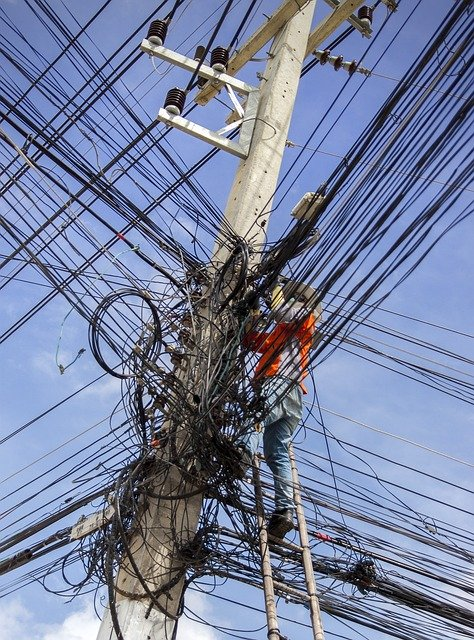
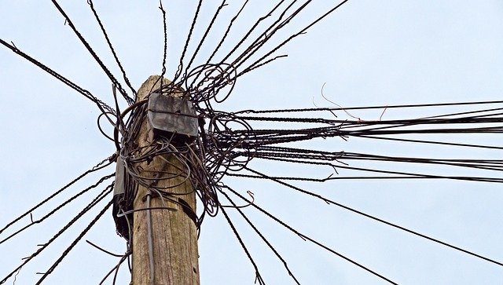

---
output:
  xaringan::moon_reader:
    seal: false
    css: [default, "my-style.css"]
    lib_dir: libs
    includes:
       in_header: my-header.html
    nature:
      countIncrementalSlides: false
      beforeInit: macros.js
      
---
class: inverse, middle, center

### *fallacies and biases*

*how NOT to think logically*

.space[.]

George Matthews, Pennsylvania College of Technology

*2019*

.note[press "h" for help on keyboard controls]

---
name: how-logical
class: inverse, middle
### How logical are we really?
.pull-left[

]

.pull-right[

{{content}}

]
---
template: how-logical

We may all be *capable* of listening to reason but...

---
template: how-logical

We may all be *capable* of listening to reason but...

- We get fooled by fallacies.

---
template: how-logical

We may all be *capable* of listening to reason but...

- We get fooled by fallacies.

  - Fallacies are bad arguments that can look good if we are not paying attention.

---
template: how-logical

We may all be *capable* of listening to reason but...

- We get fooled by fallacies.

  - Fallacies are bad arguments that can look good if we are not paying attention.

- Our thinking gets short-circuited by cognitive biases.

---
template: how-logical

We may all be *capable* of listening to reason but...

- We get fooled by fallacies.

  - Fallacies are bad arguments that can look good if we are not paying attention.

- Our thinking gets short-circuited by cognitive biases.

  - Cognitive biases are "bugs" in our mental operating systems the convince us that we know what just isn't so.

---
layout: false
class: inverse

### *types of fallacies*

--

#### Fallacies of relevance

--

- Rely on irrelevant information to push the argument along.

--

#### Fallacies of ambiguity

--

- Depend on multiple meanings of key terms to fool us.

--

#### Fallacies of presumption

--

- Rely on hidden assumptions to establish their conclusions.

--

.space[.]

.note[NOTE: fallacies are typically invalid arguments that rely on tricks to close the gap between premises and conclusions.]

---
class: inverse

### *types of cognitive biases*

--

#### Hot biases

--

- *Motivated irrationality:* ways in which our thinking goes off the rails when its results would conflict with what we want.

--

#### Cold biases

--

- *Unmotivated irrationality:* mistakes in reasoning that are by-products of the way our minds are built.

--

.space[.]

.note[NOTE: cognitive biases are the result of the complexity of our mental "software" and the fact that our reasoning minds are not entirely separate from our emotional and perceptual minds.]

---
layout: false
layout: true
class: inverse, middle

.left-column[

#### fallacies of relevance

]

---

### .center[*appeal to authority*]

.right-column[
.example[

Stephanie is a scientist and she says that vaccines cause autism.

***

Thus vaccines are not as safe as the doctors are telling us.

]
]

--

.space[.]

While we often have no choice but to rely on experts, simply appealing to their expertise is never a good idea. 

--

Instead we should actually see what their claims are based on, otherwise we still have no real reason to believe what they tell us. 

---

### .center[*ad hominem*]

.right-column[
.example[

My trainer has me on a strict diet and says that my health will be better if I lose some weight.

***

But I saw him binge eating ice cream the other day, so I guess his advice is worthless.

]
]

--

.space[.]

Here we are attacking what is said based on who is saying it by pointing out their failure to "practice what they preach."

--

But that isn't relevant since the same argument might be given by anyone else.

---

### .center[*popular appeal*]

.right-column[
.example[

Segregation laws were once popular in the American south, they were democratically enacted.

***

Therefore segregation was acceptable.

]
]

--

.space[.]

There are limitations on the principle of "the majority rules" and these are known as rights.

--

In committing this fallacy we overlook the fact that sometimes a majority of people might just be wrong and that asking for opinions about something is not always the best way to find out the truth about it.

---

### .center[*appeal to force*]

.right-column[
.example[

Matthews, either I pass this class or you might end up having an unfortunate "accident."

***

Ha! I knew you would realize my work was better than you first said it was.

]
]

--

.space[.]

Threats might be effective as a way of getting people to do what you want, but they don't really provide us with any *reasons* for belief.

--

At best they provide incentives, but never *reasons* in support.

---

### .center[*appeal to consequences*]

.right-column[
.example[

If evolution is correct then we are all related to all other organisms on the planet.

I refuse to admit that I am related to cockroaches in any way.

***

Therefore evolution must be wrong.

]
]

--

.space[.]

While we may not *like* the consequences of a theory, if the evidence really supports it, we'll just have to get used to them.

---

### .center[*naturalistic fallacy*]

.right-column[
.example[

Women should not be allowed into combat positions in the military, since, after all, women are not as aggressive as men are.

]
]

--

.space[.]

There are a couple of problems with this argument, first that it judges individuals in terms of generalizations about the group they belong to. Not all men and women fit the general pattern.

--

Second it ignores the distinction between the way things are *by nature* and what *we decide* based on such concepts as rights and duties.

---

### .center[*genetic fallacy*]

.right-column[
.example[

This study was funded by a large pharmaceutical company, so we can dismiss it as propaganda intended only to serve the interests of the corporation's stockholders.

]
]

--

.space[.]

This fallacy is a generalization of the last one -- it appeals to the origins of something to determine the basic nature of that thing.

--

Like other fallacies of relevance this argument mistakes the messenger for the message -- isn't *what* is said decisive, not *who says it*?

---

### .center[*red herring*]

.right-column[
.example[

Why do you keep saying that I am guilty of committing a crime, when there are important business decisions that need to be made in running this company?

]
]

--

.space[.]

This is less of a formal argument style and more of a debating tactic. 

--

Diverting attention from the topic at hand doesn't settle it one way or the other.

---

### .center[*weak analogy*]

.right-column[
.example[

I oppose taxation because it involves taking money from me unwillingly and that is the same thing as theft!

]
]

--

.space[.]

Analogies can help us illuminate obscure or abstract concepts, but they can also mislead us since they only go so far.

--

We may wonder in this case about any relevant differences between taxation and theft.

---
layout: false
layout: true
class: inverse, middle

.left-column[

#### .darkgray[fallacies of relevance]

#### fallacies of ambiguity
]

---

### .center[*equivocation*]

.right-column[
.example[

Religion depends on faith in God.

Science depends on faith in observation and data-analysis.

***

Therefore science is not really very different from religious belief.

]
]

--

.space[.]

This argument overlooks important differences between the meaning of "faith" in these two contexts.

--

So a scientist would be rightfully criticized for simply saying "I believe my results are correct even though the data just don't show it." 

---

### .center[*straw person*]

.right-column[
.example[

My opponent in this debate has stated that she doesn't believe in the Biblical creation story.

***

But that amounts to saying that there is no meaning at all in life, which is ridiculous.

]
]

--

.space[.]

This is another debating trick that fails to address the topic at hand in the interest of scoring points with an audience sympathetic to your viewpoint.

--

In debates it may be tempting to paraphrase our opponent's viewpoint, but we really should be careful not to misrepresent it.

---

### .center[*cherry picking*]

.right-column[
.example[

There are studies that show that vaccines are linked with autism.

***

So parents should have the right to opt out of childhood vaccination.

]
]

--

.space[.]

There is likely to be "evidence" for just about anything that we want if we look hard enough and ignore any evidence to the contrary.

--

But the question is not whether *some* evidence supports our preferred viewpoint, but what the overall pattern of evidence shows. Even a broken clock is right twice a day.

---
layout: false
layout: true
class: inverse, middle

.left-column[

#### .darkgray[fallacies of relevance]

#### .darkgray[fallacies of ambiguity]

#### fallacies of presumption
]

---

### .center[*mere assertion*]

.right-column[
.example[

There is no evidence linking asbestos to cancer.

]
]

--

.space[.]

This is not even really an argument, but a simple statement offered without evidence.

--

It may seem like just stating something without argument would fail to convince anyone, and yet there is nothing like repeating a simple statement enough to get it stuck in people's heads. See [anchoring effects.](#anchoring-effects)

---

### .center[*begging the question*]

.right-column[
.example[

I know that ghosts exist because I have seen them with my own eyes.

]
]

--

.space[.]

While many people trust eyewitness testimony, the question here is how someone might *know* that what they saw was really a ghost.

--

At a minimum this would require the assumption that ghosts exist, but isn't that what the argument is claiming to prove?

---

### .center[*appeal to ignorance*]

.right-column[
.example[

There is no proof that the CIA did *not* assassinate Kennedy and then cover it up.

***

That's why I think that they did.

]
]

--

.space[.]

Conspiracy theories often rely on appeals to ignorance like this.

--

They shift the "burden of proof" to someone opposing their viewpoint as opposed to providing sufficient evidence to prove their claims to be correct.

---

### .center[*false dilemma*]

.right-column[
.example[

Either you are on the reservation or you are off the reservation.

]
]

--

.space[.]

This is a quote from Richard Nixon, who in the last days of his presidency, believed that everyone who was not completely on his side was completely against him.

--

There certainly were other options, such as being partly on his side and partly opposed. This is also known as the "black or white fallacy."

---

### .center[*hasty generalization*]

.right-column[
.example[

Three Democrats I spoke with are opposed to abortion.

***

Thus all Deomcrats are opposed to abortion.

]
]

--

.space[.]

This is clearly an insufficient sample size to be convincing evidence for the a claim made about millions of people.

--

Reliance on "anecdotal evidence" is another variety of this fallacy in that anecdotes report individual cases that may or may not show a general pattern.

---

### .center[*slippery slope*]

.right-column[
.example[

If we allow human cloning, we'll end up with a dystopian future like in the movie "The Island" where clones are made just for "spare parts" and have no rigfhts of their own.

]
]

--

.space[.]

Alarmist claims about what will *inevitably* happen as a result of doing something or other are hard to avoid since we do tend to think of the worst case scenario.

--

In this case, since a clone is nothing but an artificially produced *twin* why would we expect laws against murder not to be enforced in their case?

---

### .center[*false cause*]

.right-column[
.example[

]
]

--

.space[.]

Y

---

### .center[*circular reasoning*]

.right-column[
.example[

]
]

--

.space[.]

Y

---
layout: false
layout: true
class: inverse, middle

.left-column[

#### .darkgray[fallacies of relevance]

#### .darkgray[fallacies of ambiguity]

#### .darkgray[fallacies of presumption]

#### hot biases
]

---

### .center[*confirmation bias*]

.right-column[
.example[

]
]

--

.space[.]

Y

---

layout: false
layout: true
class: inverse, middle

.left-column[

#### .darkgray[fallacies of relevance]

#### .darkgray[fallacies of ambiguity]

#### .darkgray[fallacies of presumption]

#### .darkgray[hot biases]

#### cold biases
]

---

### .center[*anchoring effects*]

.right-column[
.example[

]
]

--

.space[.]

Y

---
layout: false
class: inverse, bottom, center, credits

.credit-image[

]

.space[.]

#### Credits

*Built with:*

[Rstudio](https://rstudio.com/products/rstudio/) 
 
[xarignan](https://github.com/yihui/xaringan) html presentation framework 

*Images by:*
Image by <a href="https://pixabay.com/users/AbsolutVision-6158753/?utm_source=link-attribution&amp;utm_medium=referral&amp;utm_campaign=image&amp;utm_content=2654084">Gino Crescoli</a>, <a href="https://pixabay.com/users/JonasKIM-7133458/?utm_source=link-attribution&amp;utm_medium=referral&amp;utm_campaign=image&amp;utm_content=3233392">Jonas KIM</a>, and <a href="https://pixabay.com/users/aitoff-388338/?utm_source=link-attribution&amp;utm_medium=referral&amp;utm_campaign=image&amp;utm_content=1822040">Andrew Martin</a> from <a href="https://pixabay.com/?utm_source=link-attribution&amp;utm_medium=referral&amp;utm_campaign=image&amp;utm_content=1822040">Pixabay</a>

**For more slideshows visit:**

[ethics slideshows home page](https://gwmatthews.github.io/ethics-slideshows/index.html)

[or get the source code](https://github.com/gwmatthews/ethics-slideshows) 

