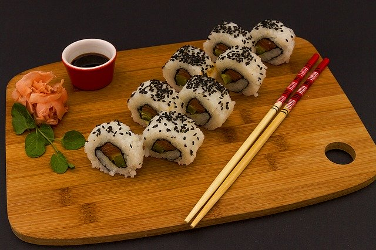
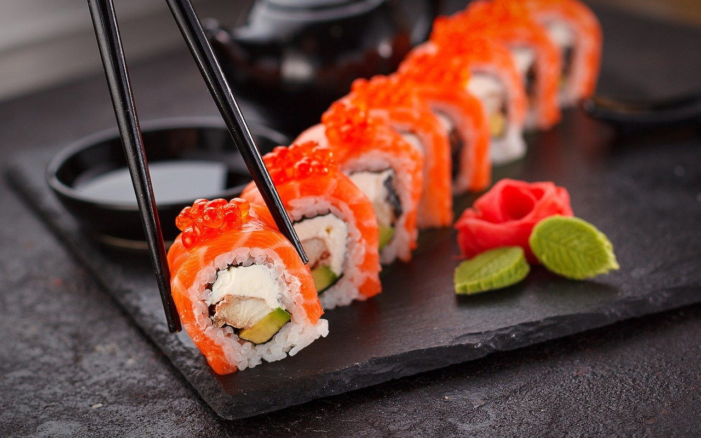

class:  middle, center

### *relativism*

#### *Is ethics in the eye of the beholder?*

.space[.]

George Matthews, Pennsylvania College of Technology

*2020*

.space[.]

.note[press "h" for help on keyboard controls]

---
layout: true
class: double

### *a basic distinction*

---

.pull-left[

.center[
#### facts
]

]

--

.pull-right[

.center[
#### values
]

]

---

.pull-left[

.center[
#### facts
]

.argument[
Factual statements report on how the world really *is.*
]

]

.pull-right[

.center[
#### values
]
]

---

.pull-left[

.center[
#### facts
]

.argument[
Factual statements report on how the world really *is.*
]
]

.pull-right[

.center[
#### values
]

.argument[
Statements about values express how we think things *should be.*
]
]

.space[.]

--

- Are claims about values just a matter of opinion?

--

- If they are just opinions, there would be little point to ethical debate and discussion.

--

- If they are not just opinion, what *are* they all about?

---
layout: true
class: wide

### *relativism*

---

--

.note[

According to relativism...

]

--

- Value judgments are personal, rooted in our sense of identity.

--

- They are absorbed from our cultural environments.

--

- Like cultural norms regarding food, manners and personal affairs they are not subject to critical evaluation.

---

.space[.]

.pull-left[

> There is no disputing taste.
>
> -- David Hume

]

--

.space[.]

.note[
.wide[

QUESTION: are ethical norms like taste in food and thus subject to disagreement with no way of settling disputes? Either you like sushi or you don't... 

]
]

---
layout: false

### *a note on ethical theories*

--

.space[.]

Every theory we will look at:

--

- Makes certain .purple[assumptions]: we have to start *somewhere*.

--

- Has .purple[implications]: *if it is true*, then we have to accept other stuff too.

--

- Requires support in an .purple[argument]: none are *obvious* even if they might seem believable at first glance.

---
layout: true
class: wide

### *implications of relativism*

.space[.]

---

--

#### If relativism is true...

--

- There are no moral absolutes.

--

.space[.]

.example[

But this implies that there is nothing, no matter how repugnant it seems, that can truly be called evil, as long as *somebody* thinks of it as acceptable.

]

---

#### If relativism is true...

--

- Moral progress makes no sense.

--

.space[.]

.example[

Since progress assumes that there is a standard to compare one practice or belief with another and relativism denies the existence of any independent standards of moral evaluation, things can never get *better* they can only be *different.*

]

---

#### If relativism is true...

--

- We cannot really discuss ethical issues we people we disagree with.

--

.space[.]

.example[

If there is no common framework for discussion, we must live in morally distinct universes and can only talk past each other.

]

---
layout: true
class: double

### *Is relativism true?*

.space[.]

---

--

#### .center[The argument from cultural differences]

.argument[

Different groups have different views on right and wrong.

***

Therefore there are no moral standards that can apply in all cases.

]

--

.space[.]

- Is this argument even valid?

--

- Do different views about how to deal with *stop signs* imply that there are no standards in that case?

---

--

#### .center[The argument from learning]

.argument[

We acquire our sense of right and wrong from our immediate cultural environments, and these are different in different cultures.

***

Thus there are no such thing as moral universals.

]

.space[.]

--

- Doesn't this argument *beg the question*?

--

- Yes we learn things from those who raise us, but that tells us nothing about whether *we can* independently evaluate what we learn. 

---

--

#### .center[The argument from tolerance]

.argument[

Different cultures may have equally valid, but incompatible ways of regulating social interaction.

***

Thus in the interests of tolerance we should accept that relativism is true.

]

.space[.]

--

- The premise is true, but does this imply that that there are *no* deeper values that *all* cultures share and implement in different ways?

--

- Can a relativist really appeal to the *moral* value of tolerance? 

---
layout: true
class: wide

### *the big question*

---

.space[.]

--

Are moral claims more like aesthetic judgments? 

--

- If so we would have individual preferences and that's all there is to it.

---

.space[.]

Or are moral claims more like judgments about facts or the law?

--

- We might disagree but there would in principle be some basis for figuring out who is right and who is wrong.

---
layout: true
class: wide

### *assessing relativism*

.left-column[

#### .purple[its appeal]

#### .darkgray[its basis]

#### .darkgray[questions]

]

---

--

.right-column[

.space[.]

.example[

Relativism gives us a quick and easy way to account for disagreements about right and wrong and the fact that it may seem like we live in different moral universes than others.

]
]

---

.right-column[

.space[.]

.example[

Plus it gets us off the hook and out of the hard work of really trying to understand someone we deeply disagree with.

]
]

---
layout: true
class: wide

### *assessing relativism*

.left-column[

#### .darkgray[its appeal]

#### .purple[its basis]

#### .darkgray[questions]

]

---

--

.right-column[

.space[.]

.example[

Arguments in favor of relativism tend to beg the question.

What *does* disagreement show about values, besides the fact that we tend to have different opinions on things?

]
]

---

.right-column[

.space[.]

.example[

Even granted that we acquire values from our cultural surroundings, it doesn't follow that we never move on from them.

Don't we all have the ability to independently reevaluate our cultural programming?

]
]

---

.right-column[

.space[.]

.example[

Yes tolerance of other peoples' approach to life is typically a good thing.

But wouldn't a relativist also have to accept that intolerance is just as "good" as tolerance?

]
]

---
layout: true
class: wide

### *assessing relativism*

.left-column[

#### .darkgray[its appeal]

#### .darkgray[its basis]

#### .purple[questions]

]

---

.right-column[

.space[.]

.example[

Maybe our disagreements are so bitter because we agree on a deeper level.

What if our disagreements were about how to implement common core values?

]
]

---

.right-column[

.space[.]

.example[

All human cultures seem to share values like:

- Maintain social order and help the group survive.

- Don't always put yourself first.

- Honor the dead.

- Don't kill humans unless you have a compelling reason to do so.

]
]

---

.right-column[

.space[.]

.example[

*Open questions:*

- How deep to core values go?

- On what basis can we reevaluate the values we are born into?

- What are the limits to tolerance -- what exactly is *not worthy* of being tolerated and why?

]
]

---
layout:false
class: wide

### find out more

---
class:  bottom, center, credits

.credit-image[

]

.space[.]

#### Credits

*Built with:*

[Rstudio](https://rstudio.com/products/rstudio/) 
 
[xarignan](https://github.com/yihui/xaringan) html presentation framework 

*Images by:*
Image by <a href="https://pixabay.com/users/noiresur-721771/">Javier Galvez</a>, <a href="https://pixabay.com/users/prafalarcomomarcos-5541358/">prafalarcomomarcos</a>, <a href="https://pixabay.com/users/sfbistrodubai-6352658">sfbistrodubai</a>, <a href="https://pixabay.com/users/juangallardosevilla-5523047">Juan Gallardo</a>, and <a href="https://pixabay.com/users/drawsandcooks-6719143/">Kevin Petit</a> 
from <a href="https://pixabay.com/">Pixabay</a>

**For more slideshows visit:**

[ethics slideshows home page](https://gwmatthews.github.io/ethics-slideshows/index.html)

[or get the source code](https://github.com/gwmatthews/ethics-slideshows) 

.space[.]

.space[.]
