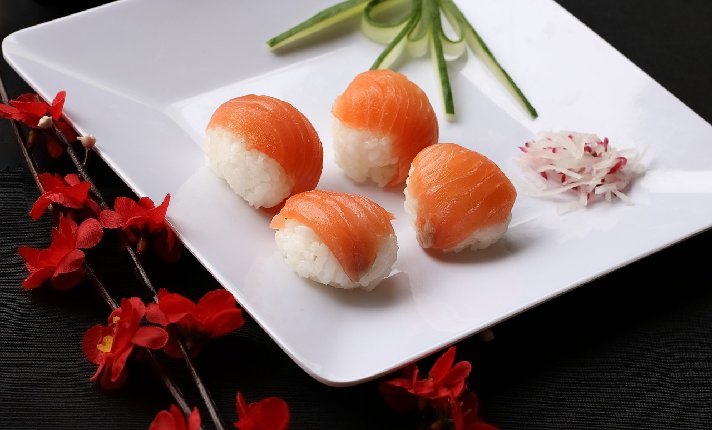

---
output:
  xaringan::moon_reader:
    seal: false
    css: [default, "my-style.css"]
    lib_dir: libs
    includes:
       in_header: my-header.html
    nature:
      countIncrementalSlides: false
      beforeInit: macros.js
---
class: inverse, middle, center

### *relativism*

*Is ethics in the eye of the beholder?*

.space[.]

.space[.]

George Matthews, Pennsylvania College of Technology

*2019*

.space[.]

.note[press "h" for help on keyboard controls]

---
layout: true
class: inverse double

### *a basic distinction*

---

.pull-left[

.center[
#### facts
]

]

--

.pull-right[

.center[
#### values
]

]

---

.pull-left[

.center[
#### facts
]

.argument[
Factual statements report on how the world *is.*
]

]

.pull-right[

.center[
#### values
]
]

---

.pull-left[

.center[
#### facts
]

.argument[
Factual statements report on how the world *is.*
]
]

.pull-right[

.center[
#### values
]

.argument[
Statements about values express claims about how things *should be.*
]
]

.space[.]

--

- The big question is whether statements about values are just a matter of opinion.

--

- If they are, there would be little point to ethical debate and discussion.

--

- If they are not, and they are not statements of fact what *are* they?

---
layout: true
class: inverse wide

### *relativism*

---

--

.note[

According to relativism...

]

--

- Value judgments are personal, rooted in our sense of identity.

--

- They are absorbed from our cultural environment.

--

- Like cultural norms regarding food, manners and personal affairs they are not subject to critical evaluation.

---

.space[.]

.pull-left[

> There is no disputing taste.
>
> -- David Hume

]

--

.space[.]

.note[

QUESTION: are ethical norms like taste in food, subject to disagreement with no way of settling disputes? Either you like sushi or you don't... 

]

---
layout: false
class: inverse

### *a note on ethical theories*

--

.space[.]

Every theory we will look at:

--

- Makes certain .purple[assumptions]: we have to start *somewhere*.

--

- Has .purple[implications]: *if it is true*, then we have to accept other stuff too.

--

- Requires support in an .purple[argument]: none are *obvious* even if they might seem believable at first glance.

