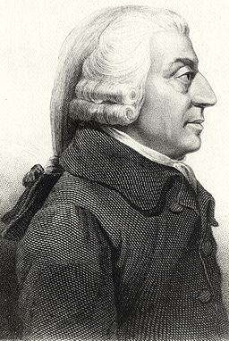
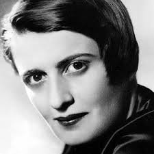

class:  middle, center

### *Egoism*

#### *on ethics and selfishness*

George Matthews, Pennsylvania College of Technology

*2020*

.note[press "h" for help on keyboard controls]

---
### *The Ring of Gyges*

--

.example[

Gyges was a shepherd who found a golden ring in a cave, and he discovered that it made him invisible when he wore it. So he seduced the local queen, killed the king and they lived happily ever after.
]

.note[
From an Ancient Persian tale retold by Plato in *The Republic*.
]

--

 

- If you had such power, would you be able to resist the temptation to act on your selfish desires?

--

- Are people inherently selfish and only kept in check by fear of getting caught?

---

### *The philosophy of selfishness*

--

.topcap[
Psychological Egoism
]

--

.argument[

We *cannot* be unselfish, so we should forget about even trying to be ethical.

]

--

.topcap[
Ethical Egoism
]

--

.argument[

We *should not* be unselfish since there are good reasons to always put yourself first.

]

--

.note[

 

These are related but different ways of pointing out the limitations of ethics, as either *unrealistic* or *counter-productive.*

]

---

### *Psychological Egoism*

--

- A purely *descriptive* theory about the nature of human motivation.

--

- Claims that ethics is *impossible* since there is no such thing as a "selfless good deed."

--

- Presents itself as a realistic alternative to sentimental idealism about human beings.

---
### *Deflating altruism*

--

Psychological Egoism (PE) argues that all claims about selfless good deeds are mistaken since we *always* have hidden selfish motives.

--

.topcap[

one example:

]

.argument[

So what if somebody gives their money to charity?

They are probably just doing it to make themselves feel better.

]

--

- How is this not just a cynical dismissal of generosity and instead a theory to be taken seriously?

--

- Let's consider the arguments...

---
layout: true

### *Is PE true?*

---

--

.topcap[

My choices are mine...

]

--

.argument[

If I freely decide to do something it must be for my own reasons, otherwise I couldn't act.

This means all decisions of mine have personal motives.

***

So PE is true, everything I do deliberately is selfish.

]

--

- This seems like common sense psychology.

--

- But perhaps there is a subtle shift of meaning here: does it follow that all motives are *for my sake alone* just because they are *my motives*?

---

--

.topcap[

The argument from hidden motives

]

--

.argument[

If PE is true, it should be possible to find a hidden motive behind all apparently altruistic acts.

We can find a hidden motive behind all apparently altruistic acts.

***

So PE is true.

]

--

- Good theories need evidence to back them up.

--

- PE has *unlimited evidence* to back it up, since *any* action that seems altruistic can be dismissed as the result of hidden selfish motives, so it's a great theory, right?

---
layout: true

### *Theories, evidence and testing*

---

--

- A theory attempts to explain something, but there are always many possible explanations for anything. So how can we pick the best?

--

.topcap[
Appealing to evidence in favor of your theory won't work.
]

--

.argument[

If autism is caused by vaccinations, then many people who were vaccinated will have autism.

Many vaccinated people do have autism.

***

Thus vaccination causes autism.

]

--

- The problem here is a logical problem: this argument is .red[INVALID].

---

--

.topcap[
A better approach is to test your claims.
]

--

.example[

If autism is caused by vaccinations, then people who were not vaccinated would have autism at lower rates.

But autism rates are the same among people who were vaccinated and those who were not.

***

Thus vaccination does not cause autism.

]

--

- This argument is .red[VALID], and shows our explanation of the cause of autism to be a bad explanation.

---

--

- All explanations must be *testable* and a real test requires at least the possibility of failure. 

--

- Good explanations are testable or *falsifiable* but pass those tests and have not been *falsified.*

--

- The problem with Psychological Egoism is that it is *non-falsifiable*.

--

- No matter what examples of unselfishness we give to a backer of this theory they can always "find" a selfish motive, so there is *no possible test* that the theory can fail.

--

 

Is there really always a selfish motive behind everything we do? Maybe, maybe not, but PE simply *assumes* it must be there.

---
layout:false

### *Me, myself and I*

--

- Psychological egoism misses something important about human motivation: it can be complex and our motives can be mixed.

--

- We can have self-serving and altruistic motives at the same time and may not even be aware of this when we make decisions.

--

- .purple[Ethical Egoism] starts off by recognizing this.

--

- Ethical Egoists argue, however, that we *should* disregard motives that are not self-serving because it is always best to put ourselves first.

--

 

Let's see why someone might argue this way.

---
layout: false 

### *Ethical Egoism*

--

- Ethical Egoism is a *normative* theory about what we should and shouldn't do.

--

- It claims that ethics is *self-defeating* since acting for the sake of others ultimately leads to a worse outcome, for *all of us.*

--

- Often used in political and economic arguments about capitalism and socialism.

---
layout: true

### *Adam Smith's "invisible hand"*

.left-column[

 

.center[
.note[1723-1790
]
]
]

---

--

.myright-column[

- Adam Smith is often considered the founding father of capitalism for his defense of free-market economic principles the book *On the Wealth of Nations* published in 1776.

]

---

.myright-column[

- Adam Smith is often considered the founding father of capitalism for his defense of free-market economic principles the book *On the Wealth of Nations* published in 1776.

- For Smith we need only allow people to pursue private gain in the marketplace and "the invisible hand" of supply and demand will ensure a socially optimal outcome -- fair prices, innovation, economic efficiency.

]
---
layout: true

### *Rand on the virtue of selfishness*

.left-column[

 

.center[
.note[1905-1982
]
]
]

---

--

.myright-column[

- Ayn Rand, a Russian emigre to the US, was a novelist and political thinker who gained an almost cult-like following.

]

---

.myright-column[

- Ayn Rand, a Russian emigre to the US, was a novelist and political thinker who gained an almost cult-like following.

- She was deeply anti-communist and advocated an extreme form of individualism according to which it is simply *wrong* to ever put someone else's interests ahead of one's own.

]

---

.myright-column[

- Ayn Rand, a Russian emigre to the US, was a novelist and political thinker who gained an almost cult-like following.

- She was deeply anti-communist and advocated an extreme form of individualism according to which it is simply *wrong* to ever put someone else's interests ahead of one's own.

- Among her fans are Ronald Reagan, Alan Greenspan, Rand Paul and Donald Trump.

]

---
layout: true

### *Is Ethical Egoism true?*

---

--

.topcap[

The capitalist's argument

]

--

.example[

Competition leads to the best social outcomes: greater productivity, innovation, performance, etc.

The best way to encourage competition is by appealing to our individual desires for rewards, our selfish desire to get ahead.

***

So we should encourage people to pursue individual gain and let the good of all take care of itself.

]

--

- According to this argument, helping others hinders competition and undermines the benefits of competition.

---

--

In some cases competition does lead to a good outcome.

--

.red[But...]

--

- Competition is easily undermined by the winners of each "round," so rewarding winners does *not* automatically lead to the best outcomes.

--

- Winners in economics can establish monopolies that destroy competition.

--

- So they must be broken up, and likewise in sports -- the winning teams in get the *worst* draft picks to ensure *fair* competition in future seasons.

--

- The capitalist's argument has a deeper problem: Why would selfish people even *care* about the good of all? Is it still a defense of *Egoism* if we all do care?

---

--

.topcap[

Rand's argument

]

--

.example[

The most valuable thing about human life is individuality.

Helping others is a denial of one's own individuality.

***

So one should never do anything for others.

]

--

- Rand assumes that the pursuit of happiness is a *zero sum game*--my gain requires your loss and vice-versa.

--

- But doesn't cooperation help us *all* out more than always going it alone?

---
layout: false

### *From me to us*

--

- Egoism is based on a conception of human beings as *isolated individuals* each pursuing their own personal interests and only arbitrarily connected with others.

--

- This is too simple a model, since our unique capabilities as a species - language, life in complex societies, science, art and industry - require cooperation and coordination with others.

--

.topcap[

The next big question is thus...

]

--

.argument[

Is there a rational basis for the rules governing our lives together in society? Or are we stuck with appealing to custom, authority and our shifting alliances with others to maintain social order?

]

---
layout: false

### *Find out more*

[Egoism](https://plato.stanford.edu/entries/egoism/): a comprehensive account from the Stanford Encyclopedia of Philosophy.

[What's in it for me?](https://press.rebus.community/intro-to-phil-ethics/chapter/whats-in-it-for-me-on-egoism-and-social-contract-theory/), Ya-Yun (Sherry) Kao, in *Introduction to Philosophy: Ethics.* This chapter covers Egoism as well as our next theory, Social Contract Theory.

[Inequality in The USA](https://youtu.be/QPKKQnijnsM): a great video on what Americans want in terms of wealth distribution, our perception of what it is, and the reality. It turns out to be different than you might think.

[The New Age of Ayn Rand:](https://www.theguardian.com/books/2017/apr/10/new-age-ayn-rand-conquered-trump-white-house-silicon-valley) decades after her death her fiction continues to have an outsized influence on American public life. Read more about this here in this article from the British new site *The Guardian*.

---
layout: false

class: center credits

 

#### Credits

*Built with:*

[Rstudio](https://rstudio.com/products/rstudio/) 

[xarignan](https://github.com/yihui/xaringan) html presentation framework 

*Photos by:*

[Quentin Jouvray](https://pixabay.com/users/jinkyr-6852513/) and [Michael Gaida](https://pixabay.com/users/michaelgaida-652234/) at Pixabay

[download this presentation](./pdf/06-egoism.pdf) or [print it](./pdf/06-egoism-print.pdf)

[editorial suggestions and comments](https://github.com/gwmatthews/ethics-slideshows/issues): requires a (free) GitHub account.
