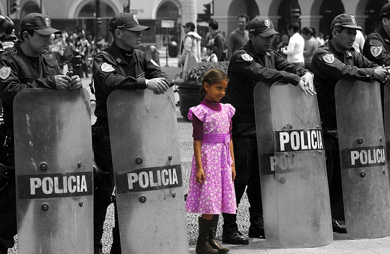
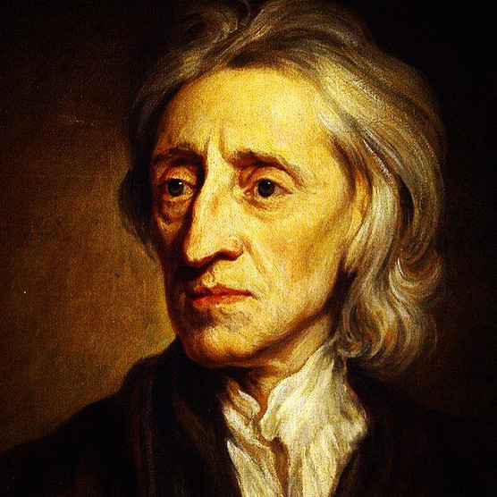
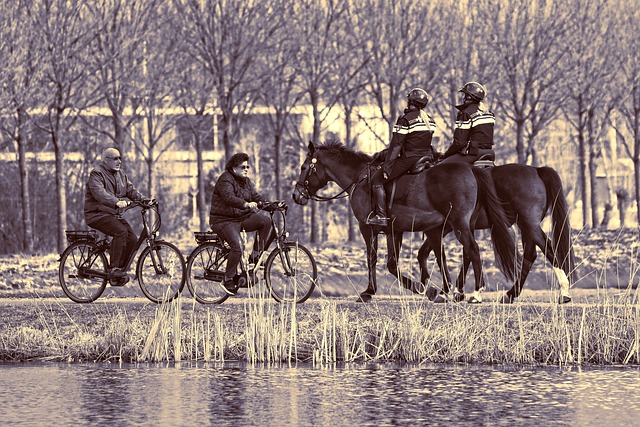

class:  middle, center

### *Social Contract Theory*

#### *ethics by agreement*

George Matthews, Pennsylvania College of Technology

*2020*

.note[press "h" for help on keyboard controls]

---
### *The ties that bind*

--

- Our social lives depend on our willingness to cooperate -- to sometimes set aside our own interests for the sake of others.

--

- *Trust* is central to cooperation -- my willingness depends on your willingness and my trust that you will follow through.

--

.topcap[

Our next question:

]

--

.argument[

Is there a *rational basis* for trust, or must trust be based on something besides reason, like feelings of sympathy, shared history, or emotional identification?

]

---
layout:true

### *Traditional and modern societies*
---

--

.pull-left[
.center[

#### traditional

]
]

--

.pull-right[
.center[

#### modern

]
]

---

.pull-left[
.center[

#### traditional

]

.example[

Rooted in time, place, culture, established authority and inherited roles.

Conservative values emphasizing stability and hierarchy.

]
]

.pull-right[
.center[

#### modern

]
]

---

.pull-left[
.center[

#### traditional

]

.example[

Rooted in time, place, culture, established authority and inherited roles.

Conservative values emphasizing stability and hierarchy.

]
]

.pull-right[
.center[

#### modern

]

.example[

Less bound by tradition and hierarchy, society is arena where individuals compete for status and power.

Liberal values emphasizing progress and individuality. 

]
]

--

 

.note[

Many societies are somewhere in between, with traditional and modern institutions, aspects and values.

]

---
layout: true

### *Hobbes and the Social Contract*

.left-column[

 

.center[
.note[1588-1679
]
]
]
---

--

.myright-column[

Thomas Hobbes was the founder of modern political philosophy.

]

--

.myright-column[

His 1651 book *Leviathan* asks:

]

--

.myright-column[
.narrow-text[

If there were no religion, no customs and no laws, how and why would a individuals form a society, establish laws and what would they look like?

]
]

---

.myright-column[

If there were no rules, and we lived in a "State of Nature," we would be free to do as we please, thus leading to "war of all against all."

]

--

.myright-column[
.narrow-text[

*"No arts; no letters; no society; and which is worst of all, continual fear and danger of violent death; and the life of man solitary, poor, nasty, brutish, and short."*

]
]

---

.myright-column[

Thus it makes sense that we would agree to establish rules limiting individual liberty in exchange for the security.

]

---

.myright-column[

Thus it makes sense that we would agree to establish rules limiting individual liberty in exchange for the security.

This is the Social Contract that creates moral and social rules and establishes society on the basis of reason.

]

---

.myright-column[

Thus it makes sense that we would agree to establish rules limiting individual liberty in exchange for the security.

This is the Social Contract that creates moral and social rules and establishes society on the basis of reason.

The same arguments apply to all moral rules -- they are *invented by us* to keep the peace in a world of *self-interested, but also rational agents*.

]

---
layout: false

### *An argument for Social Contract Theory*

--

.topcap[

Morals by agreement

]

--

.argument[

A world in which there were no rules regulating our behavior would be unbearable.

Thus we all have an interest in establishing and abiding by basic rules against lying, stealing, murder, not keep promises, etc.

***

Thus we create and follow such rules.

]

--

We may have an *interest* in establishing rules, but does this mean that we can do so on the terms set out so far?

---

### *Trust within reason*?

--

- Hobbes thinks we can't trust each other in the state of nature because we are all motivated by self-interest alone.

--

- So we setup rules to reign in our self-interest -- the Social Contract.

--

- But if these rules are to be effective we need to also create an *authority* to enforce them.

--

- Yet why should we *trust the enforcers* to follow the rules if they are self-interested people just like us?

--

- Let's consider a famous illustration of the problem of trust.

---
layout: true

### *The prisoner's dilemma*

---

--

.example[

You and your partner have been caught robbing a convenience store. The police have evidence that you are also responible for a bank robbery but not enough to convict you. So they make each of you the following offer in seprate rooms:

- If you both stay silent about the bank job you each get 1 year in jail.

- If confess to the bank job and your partner does not, you will go free and your partner will get 5 years in jail.

- If you both confess you each get 3 years in jail.

]

--

- What would you do, and what is the .red[rational] thing to do?

--

.note[Think about this for a moment before going on... ]

---

.topcap[The rational solution]

--

.example[

Since you cannot tell ahead of time whether your partner will confess or not, you should consider each possibility in turn.

- If your partner confesses, you should confess, since 3 years in jail is better than the 5 you'd get if you stayed silent.

- If your partner stays silent, you should confess, since going free is better than the 1 year in jail you'd get if you also stayed silent.

- So *whatever* your partner does it is better for you to confess.

]

--

- Too bad you couldn't both keep your mouths shut!

---

--

- Since both of you are rational, you will both end up in jail for three years.

--

- It is the temptation of avoiding jail and the fear of being ratted out that makes the collectively optimal outcome of staying silent and getting 1 year in jail *an inaccessible outcome*.

--

- If you could *trust* your partner to stay silent you could avoid the worse outcome of 3 years each.

--

- But reason and self-interest dictate that we have to confess.

--

Where in our real social lives do similar dilemmas appear?

---

--

.purple[**The arms race:**] Nuclear weapons are really expensive and dangerous to have around, but can we trust the Russians *not* to build them? Nope! Too bad we can't spend that money on something that would make our lives better!

--

.purple[**The roommate's dilemma:**] It would be best for all of us to keep the place clean, but just this once I'll leave my dirty dishes for later. Why is this place always a dump?

--

.purple[**The fisherman's dilemma:**] If we are to have sustainable livlihood and not deplete the fish stocks we all have to limit our catch. But it sure is tempting to overfish now for the easy money while I still can and before the other fisherman hang me out to dry by themselves overfishing.

--

.note[When you start to notice them, prisoner's dilemmas are all over the place, especially in their multi-person variants known as "free rider problems."]

---
layout: false

### *Morality to the rescue?*

 

--

- If we could *trust* our partner not to confess, and convince her to trust as too, we could avoid a long time in jail, avoid wasting money on nuclear weapons, and not wreck common resources.

--

- Moral rules about keeping promises, loyalty and working together would help establish and maintain trust.

--

- But where do these come from and why are they so fragile?

---
layout: true

### *Locke's classical liberalism*

.left-column[

 

.center[
.note[1632-1704
]
]
]

---
.right-column[

]

---
layout: false

class: center credits

 

#### Credits

*Built with:*

[Rstudio](https://rstudio.com/products/rstudio/) 

[xarignan](https://github.com/yihui/xaringan) html presentation framework 

*Photos by:*

 and  at Pixabay

[download this presentation](./pdf/07-contract.pdf) or [print it](./pdf/07-contract-print.pdf)

[editorial suggestions and comments](https://github.com/gwmatthews/ethics-slideshows/issues): requires a (free) GitHub account.
