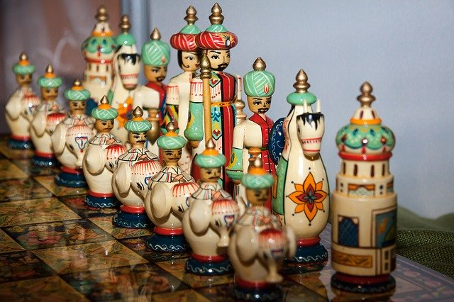
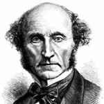

class:  middle, center

### *Utilitarianism*

#### *the best for the most*

<!--  -->

George Matthews, Pennsylvania College of Technology

*2020*

---
### *Traditional society*

--

--

.wide-list[

- Who you are matters, and some matter more than others for the sake of distribution of benefits, burdens and roles.

]

--

.wide-list[

- .red[Assumption:] *the good of all* requires that we play the roles we are all assigned by nature and inherited social status.

]

---
### *Modern society*

--

--

.wide-list[

- We all matter equally -- benefits and burdens are distributed according to a set of neutral decision procedures.

]

--

.wide-list[

- .red[Assumption:] *the good of all* is best served by allowing individuals to pursue their own conceptions of what is good for them.

]

---
layout: false

### *Utilitarianism*

.argument[

The point of morality is to make the world a better place.

Happiness is the highest good, the ultimate aim of all human activity.

***

So an action is right to the extent that it promotes greater happiness and wrong if it leads to greater unhappiness.

]

--

![:vspace 30]

- Utilitarianism offers itself as a common sense solution to the problem of finding moral common ground.

--

- We need not worry about the fact that we disagree on the *content* of a good life, since we all can agree that *whatever* it is that we are after in life, more satisfaction of our goals is always preferable to less.

---

layout: true

### *Bentham's hedonistic utilitarianism*

.left-column[

![:vspace 100]

]
---

--

.right-list[

.red[

"We are ruled by two sovereign masters, pleasure and pain."

]

]

--

.right-list[

- Bentham was a legal reformer who wanted to eliminate laws that caused more harm than they did good.

]

--

.right-list[

- For him the whole point of social and moral rules was to make our lives better.

]

--

.right-list[

- He attempted to quantify pleasures and pains and developed a method of moral calculation based on this.

]
---
layout: true

### *Mill's preference utilitarianism*

.left-column[

![:vspace 100]

]
---

--

.right-list[

.red[

"It is better to be a human dissatisfied than a pig satisfied, better to be a Socrates satisfied than a fool satisfied."

]

]

--

.right-list[

- Mill was an economist who advocated liberty for all -- men and women.

]

--

.right-list[

- For him some desires are more inherently worthy of satisfaction than others so he rejected Bentham's simple hedonism.

]

--

.right-list[

- He tried to show how all moral rules could be explained as the attempt to help as many individuals satisfy as many of their preferences as possible.

]

---
layout: false
### *Rational Choice*

.argument[

1. Figure out what you want and rank it.
2. Estimate the likelihood that different courses of action will satisfy your wants.
3. The rational choice is the choice that brings you the most benefits for the least costs.

]

--

- Everything we do has costs -- time, effort, money, opportunity costs, etc. 

--

- The rational choice in any situation is the one with the best payoff -- the most favorable balance of benefits minus costs.

--

- Utilitarianism endorses this cost/benefit analysis model of rational choice as the basis of morality.

--

.alert[How might this work?]

---
layout: true

### *From Self-interest to Morality*

---

--

.leftbar[

![:vspace 110]

]

.middletext[

![:vspace 130]

.left-blurb[

"I am a rational agent out to satisfy as many preferences as I can, if others also benefit that's great for them, but it's not really essential to me."

]
]

.rightbar[

![:vspace 110]

]

---

.leftbar[

![:vspace 110]

]

.middletext[

![:vspace 130]

.left-blurb[

"I am a rational agent out to satisfy as many preferences as I can, if others also benefit that's great for them, but it's not really essential to me."

]

.right-blurb[

"I care about others and will set aside my own interests to help them satisfy their goals, since they count just as much as I do."

]
]

.rightbar[

![:vspace 110]

]

--

---
.topcap[

The argument from maximization

]

--

.argument[

Rational maximizers of self-interest seek the best possible outcome.

The more people who benefit from my actions the better the outcome.

***

So we should always strive to get the best outcome from the most people.

]

--

- But why should I even *care* about other people getting what they want in the first place?

--

- Rational actors are *individuals* and what we want to know is why individuals would *ever* find it more rational to set their interests aside.

---

.topcap[

The public defense argument

]

.argument[

Suppose I selfishly cause harm to others for my personal gain.

I might get away with this, but what I can never do is convince others who know exactly what I am doing to let me get away with it.

***

Thus as long as rationality requires public defense, I have to accept that others count as much as I do.

]

--

- Public accountability does seem to support the moral ideal that we all count.

--

- Utilitarianism thus claims to have found a rational standard for measuring the morality of all actions -- do they genuinely serve the good of all or not?

---
layout: false

### *If Utilitarianism is true...*

--

- The right thing to do is whatever has the best consequences for everyone who is affected.

--

- Morality would have an objective and rational basis.

--

- The more we all act ethically the happier we all will be.

--

- The *good* that we do determines the *rightness* of our actions.

--

.left-column[

![:vspace 110]

]

.right-list[

![:vspace 120]

.left-blurb[

"What's not to love about utilitarianism? Let's all work to get the best outcomes for the most people!"

]

]

---

### *Technical difficulties*

--

.leftbar[

![:vspace 110]

]

.middletext[

![:vspace 130]

.left-blurb[

"My love of making you do meaningless tasks is worth exactly 3.47 times the satisfaction you will get from visiting your sick grandmother."

]

]

.rightbar[

![:vspace 110]

]

---

### *Technical difficulties*

.leftbar[

![:vspace 110]

]

.middletext[

![:vspace 130]

.left-blurb[

"My love of making you do meaningless tasks is worth exactly 3.47 times the satisfaction you will get from visiting your sick grandmother."

]

.right-blurb[

"But I see things differently, so who are you to say?"

]
]

.rightbar[

![:vspace 110]

]

--

---

### *Technical difficulties*

.leftbar[

![:vspace 110]

]

.middletext[

![:vspace 130]

.left-blurb[

"If you keep showing up late, I am going to have to let you go, it's for the good of the company."

]
]

.rightbar[

![:vspace 110]

]

---

### *Technical difficulties*

.leftbar[

![:vspace 110]

]

.middletext[

![:vspace 130]

.left-blurb[

"If you keep showing up late, I am going to have to let you go, it's for the good of the company."

]

.right-blurb[

"But if you fire me, I'll start drinking heavily and will eventually set fire to the whole building in an out of control drunken rage, so in fact it's better for the company to keep me."

]
]

.rightbar[

![:vspace 110]

]

--

---

### *Technical difficulties*

.leftbar[

![:vspace 110]

]

.middletext[

![:vspace 130]

.left-blurb[

"What does market research show about what will happen to our sales if we act unethically?"

]
]

.rightbar[

![:vspace 110]

]

---

### *Technical difficulties*

.leftbar[

![:vspace 110]

]

.middletext[

![:vspace 130]

.left-blurb[

"What does market research show about what will happen to our sales if we act unethically?"

]

.right-blurb[

"Market research is expensive so I didn't bother to do any."

]
]

.rightbar[

![:vspace 110]

]

--

---

### *Deeper problems*

--

.leftbar[

![:vspace 110]

]

.middletext[

![:vspace 130]

.left-blurb[

"Even though I promised you a permanent job I had always intended to fire you after six months and replace you with someone I could pay less."

]
]

.rightbar[

![:vspace 110]

]

---

### *Deeper problems*

.leftbar[

![:vspace 110]

]

.middletext[

![:vspace 130]

.left-blurb[

"Even though I promised you a permanent job I had always intended to fire you after six months and replace you with someone I could pay less."

]

![:vspace 20]

.right-blurb[

"When I found out I became so disillusioned with a career in business that I started a non-profit helping to house the homeless, so it's all good -- no harm, no foul!"

]
]

.rightbar[

![:vspace 110]

]

--

---

### *Deeper problems*

.leftbar[

![:vspace 110]

]

.middletext[

![:vspace 160]

.left-blurb[

"It is cheaper to be sued for product liability than it is to fix the problem so let's pretend we didn't know about it. Our profitability is beneficial to the economy!"

]
]

.rightbar[

![:vspace 110]

]

---

### *Deeper problems*

.leftbar[

![:vspace 110]

]

.middletext[

![:vspace 160]

.left-blurb[

"It is cheaper to be sued for product liability than it is to fix the problem so let's pretend we didn't know about it. Our profitability is beneficial to the economy!"

]

.right-blurb[

"But isn't it wrong to knowingly put people in danger for the sake of profits?"

]
]

.rightbar[

![:vspace 110]

]

--

---

### *Deeper problems*

.leftbar[

![:vspace 110]

]

.middletext[

![:vspace 150]

.left-blurb[

"I'm going to have to ask you not to take any more weekends off, everyone one else needs your extra contributions to support their time off."

]

]

.rightbar[

![:vspace 110]

]

---

### *Deeper problems*

.leftbar[

![:vspace 110]

]

.middletext[

![:vspace 150]

.left-blurb[

"I'm going to have to ask you not to take any more weekends off, everyone one else needs your extra contributions to support their time off."

]

![:vspace 1]

.right-blurb[

"Don't I have the right to demand the same treatment as everybody else?"

]
]

.rightbar[

![:vspace 110]

]

--

---
### *The good, the bad and the unethical*

--

- Utilitarianism is a popular view on ethics and seems to capture some features of morality -- it's impartiality and the idea that we should strive to help others out whenever that is possible.

--

.topcap[

However...

]

--

- Its problems might leave us wondering whether this is *all* there is to moral decision-making?

--

- Aren't there some limits to how we *should* treat each other than go beyond considerations of the beneficial outcomes that result?

---

layout: false

### *Find out more*

, Frank Aragbonfoh Abumere, *Introduction to Philosophy: Ethics*.

: The Internet Encyclopedia of Philosophy has a comprehensive account including lots of discussion of contemporary versions of the theory.

: in this Crash Course video, Hank Green discusses the morality of our responses to poverty and the work of a contemporary Utilitarian philosopher, Peter Singer.

---
layout: false

class: center credits

 

#### Credits

*Built with:*

 

 html presentation framework 

*Photos by:*

, ,
 and 

[download this presentation](./pdf/08-utilitarianism.pdf) or [print it](./pdf/08-utilitarianism-print.pdf)

: requires a (free) GitHub account.
