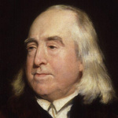
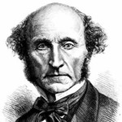

class:  middle, center

### *Utilitarianism*

#### *the best for the most*

<!--  -->

George Matthews, Pennsylvania College of Technology

*2020*

---
### *Traditional society*

--

--

.wide-list[

- Who you are matters, and some matter more than others for the sake of distribution of benefits, burdens and roles.

]

--

.wide-list[

- .red[Assumption:] *the good of all* requires that we play the roles we are all assigned by nature and inherited social status.

]

---
### *Modern society*

--

--

.wide-list[

- We all matter equally -- benefits and burdens are distributed according to a set of neutral decision procedures.

]

--

.wide-list[

- .red[Assumption:] *the good of all* is best served by allowing individuals to pursue their own conceptions of what is good for them.

]

---
layout: true

### *Bentham's hedonistic utilitarianism*

.left-column[

![:vspace 100]

]
---

--

.right-list[

.red[

"We are ruled by two sovereign masters, pleasure and pain."

]

]

--

.right-list[

- Bentham was a legal reformer who wanted to eliminate laws that caused more harm than they did good.

]

--

.right-list[

- For him the whole point of social and moral rules was to make our lives better.

]

--

.right-list[

- He attempted to quantify pleasures and pains and developed a method of moral calculation based on this.

]
---
layout: true

### *Mill's preference utilitarianism*

.left-column[

![:vspace 100]

]
---

--

.right-list[

.red[

"It is better to be a human dissatisfied than a pig satisfied, better to be a Socrates satisfied than a fool satisfied."

]

]

--

.right-list[

- Mill was an economist who advocated liberty for all -- men and women.

]

--

.right-list[

- For him some desires are more inherently worthy of satisfaction than others so he rejected Bentham's simple hedonism.

]

--

.right-list[

- He tried to show how all moral rules could be explained as the attempt to help as many individuals satisfy as many of their preferences as possible.

]

---
layout: false

### *Find out more*

, Frank Aragbonfoh Abumere, *Introduction to Philosophy: Ethics*.

: The Internet Encyclopedia of Philosophy has a comprehensive account including lots of discussion of contemporary versions of the theory.

: in this Crash Course video, Hank Green discusses the morality of our responses to poverty and the work of a contemporary Utilitarian philosopher, Peter Singer.

---
layout: false

class: center credits

 

#### Credits

*Built with:*

 

 html presentation framework 

*Photos by:*

, ,
 and 

[download this presentation](./pdf/08-utilitarianism.pdf) or [print it](./pdf/08-utilitarianism-print.pdf)

: requires a (free) GitHub account.
