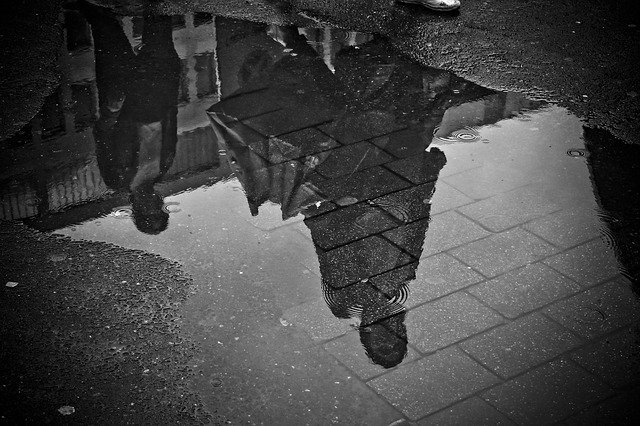
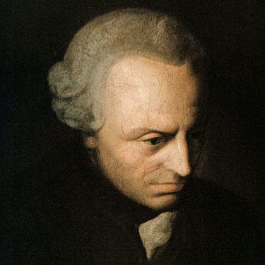

class:  middle, center

### *Kant's Ethics of Duty*

#### *What do we owe one another?*

George Matthews, Pennsylvania College of Technology

*2020*

---

### *The big question*

--

- All of the moral theories we have looked at so far have tied morality to *something else* -- culture, God, human nature, personal advantage, the social good, happiness...

--

- But don't moral demands *override* all of those at times?

--

- Having a moral conscience means that sometimes we can see that we just should or shouldn't do something **_no matter what_** else is telling us the opposite.

--

.topcap[The question of morality is thus:]

.question[

How can we possibly step back from *all* of our other concerns and act based only on what is right? Is there even such a thing?

]

---

.example[

"Two things fill the mind with ever-increasing wonder and awe, the more often and the more intensely the mind of thought is drawn to them: the starry heavens above me and the moral law within me."

]

.bottomcap[Immanuel Kant, *Critique of Practical Reason*]

---

### *Kant's ethics of duty*

.left-column[

![:vspace 70]

]

--

.right-list[

- For Kant morality is distinctive because it is unconditional, overriding, rational, and autonomous: it articulates an ideal to guide us in our social lives.

]

--

.right-list[

- The key concept here is that of moral duty -- morality imposes .alert[unconditional obligations] on us.

]

--

.right-list[

- Questions we'll need to answer are:

]

--

.wide-list[

.question[

1. What are our moral obligations anyway?
2. Why should we try to live up to their demands?
3. How can we go about doing that?

]
]
---

### *The moral ideal*

--

.caution[

If this all seems lofty and abstract, it helps to keep in mind that the point of this whole discussion is to defend an ideal we all take for granted.

]

--

- Don't we already feel that we owe each other basic respect and should never treat each other as objects to be used for our selfish ends?

--

- Don't we hold all adults are held responsible for their own decisions, to the extent that we are free to choose what to do?

--

- Don't we assume that nobody is inherently better than anyone else?

--

.topcap[But what are these ideals based on?]

---
### *Philosophical background*

--

- Kant was a major figure in the philosophical movement known as "The Enlightenment" which emphasized the role of reason in human affairs.

--

- His major works focus on three questions:

--

.question[

.spaced-list[
1. What are the nature and limits of **theoretical reason**: .alert[What can I know?]
2. What are the nature and limits of **practical reason**: .alert[What should I do?]
3. How might reason be a guide for a meaningful life: .alert[What may I hope?]

]
]

---

### *Reason as a guide*

--

- For Kant reason is fundamentally **normative** it tells us what we .alert[should] think and do. It can do this in two ways...

--

.topcap[conditionally]

.argument[

Reason tells us what we *should* think is true based on the evidence. Or it tells us what we *should* do based on our goals and the present circumstances.

]

--

.topcap[unconditionally]

.argument[

Reason tells us what we *should* think is true in all cases. It tells us what we *should* do no matter what. .alert[Can it really?]

]

---
### *Theoretical reason*

--

.topcap[conditional truths]

.example[

**Science** shows us what is true, *given* the best data available and fundamental assumptions about the way the world works.

]

--

.topcap[unconditional truths]

.example[

**Mathematics and logic** show us what has to be true *in any circumstances*.

**Philosophy** shows what has to be true *of our experience*, but cannot draw conclusions about the nature of reality in itself.

]

--

Kant is skeptical about the ability of our theoretical reason to settle questions about God, the soul or life after death.

---
### *Practical reason*

--

.topcap[conditional guidance]

.example[

**Instrumental reasoning** shows us how to best realize our goals, *given* what we want and our circumstances.

]

--

.topcap[unconditional guidance]

.example[

**Morality** shows us what is right or wrong *in any circumstances*, what we just should or shouldn't do, no matter what.

]

--

Kant argues that immoral choices are **irrational** choices and **_that_** is what makes them wrong. 

---
layout: true 
### *Moral evaluation*

---

.left-column[

#### .fade-out[motives]

#### .fade-out[assumptions]

#### .fade-out[right or wrong?]

]

--

.right-list[

To evaluate anything we are thinking of doing to see if it is morally acceptable we need to do a few things.

]

---

.left-column[

#### motives

#### .fade-out[assumptions]

#### .fade-out[right or wrong?]

]

.right-list[

To evaluate anything we are thinking of doing to see if it is morally acceptable we need to do a few things.

]

.right-list[

- First we need to ask ourselves *why* we are considering doing it, what we expect to get as a result.

]

---

.left-column[

#### .fade-in[motives]

#### assumptions

#### .fade-out[right or wrong?]

]

.right-list[

To evaluate anything we are thinking of doing to see if it is morally acceptable we need to do a few things.

]

.right-list[

- First we need to ask ourselves *why* we are considering doing it, what we expect to get as a result.

]

.right-list[

- Next we need to figure out our assumptions about the situation, others' behavior and beliefs.

]

---

.left-column[

#### .fade-in[motives]

#### .fade-in[assumptions]

#### right or wrong?

]

.right-list[

To evaluate anything we are thinking of doing to see if it is morally acceptable we need to do a few things.

]

.right-list[

- First we need to ask ourselves *why* we are considering doing it, what we expect to get as a result.

]

.right-list[

- Next we need to figure out our assumptions about the situation, others' behavior and beliefs.

]

.wide-list[

- To determine whether it is right or wrong, we then see if there are any hidden contradictions between our motives, expectations and assumptions. If there are it makes no sense and we should thus reject it.

]

--

.wide-list[

.alert[Consider some examples...]

]

---

layout: true 
### *Is stealing morally acceptable?*

---

.left-column[

#### .fade-out[motives]

#### .fade-out[assumptions]

#### .fade-out[right or wrong?]

]

--

.right-list[

Suppose I decide I want to steal something from you.

]

---

.left-column[

#### motives

#### .fade-out[assumptions]

#### .fade-out[right or wrong?]

]

.right-list[

Suppose I decide I want to steal something from you.

]

.right-list[

- If I carry out my plans I will take it from you and become its new owner, enjoying its use as if I got it in any other way.

]

---

.left-column[

#### .fade-in[motives]

#### assumptions

#### .fade-out[right or wrong?]

]

.right-list[

Suppose I decide I want to steal something from you.

]

.right-list[

- If I carry out my plans I will take it from you and become its new owner, enjoying its use as if I got it in any other way.

]

.right-list[

- But this assumes that you and everyone else respects private property, and won't steal it back from me.

]

---

.left-column[

#### .fade-in[motives]

#### .fade-in[assumptions]

#### right or wrong?

]

.right-list[

Suppose I decide I want to steal something from you.

]

.right-list[

- If I carry out my plans I will take it from you and become its new owner, enjoying its use as if I got it in any other way.

]

.right-list[

- But this assumes that you and everyone else respects private property, and won't steal it back from me.

]

.wide-list[

- This means that stealing cannot be right, because it both assumes and undermines private property -- if *everybody* stole things *nobody* could have any reason do to so.

]

---

layout: true 
### *Is lying morally acceptable?*

---

.left-column[

#### .fade-out[motives]

#### .fade-out[assumptions]

#### .fade-out[right or wrong?]

]

--

.right-list[

Suppose I decide I want to lie to you.

]

---

.left-column[

#### motives

#### .fade-out[assumptions]

#### .fade-out[right or wrong?]

]

.right-list[

Suppose I decide I want to lie to you.

]

.right-list[

- If I do this, my lie will work only if you expect me to be telling the truth.

]

---

.left-column[

#### .fade-in[motives]

#### assumptions

#### .fade-out[right or wrong?]

]

.right-list[

Suppose I decide I want to lie to you.

]

.right-list[

- If I do this, my lie will work only if you expect me to be telling the truth.

]

.right-list[

- But this assumes that you and enough other people value telling the truth, since otherwise my lie wouldn't be believed.

]

---

.left-column[

#### .fade-in[motives]

#### .fade-in[assumptions]

#### right or wrong?

]

.right-list[

Suppose I decide I want to lie to you.

]

.right-list[

- If I do this, my lie will work only if you expect me to be telling the truth.

]

.right-list[

- But this assumes that you and enough other people value telling the truth, since otherwise my lie wouldn't be believed.

]

.wide-list[

- This means that lying cannot be right, because it both assumes and undermines reliable and truthful communication as a norm -- if *everybody* lied *nobody* could have any reason do to so.

]

---
layout: false

### *Immoral actions*

--

- What these and other cases show is that immoral actions are fundamentally hypocritical -- they all depend on and at the same time undermine certain standards of behavior.

--

.caution[

This is **not quite** the same as the "golden rule" which states: treat others as you would like them to treat you. Instead it could be rephrased: .alert[treat others as your own actions assume they will treat you.]

]

--

- Kant's insight is that all immoral action involves buying into a "double standard" in which we actually accept the rules we are violating and .alert[make an exception for ourselves.]

---
### *Why be moral?*

--

.question[

If we are not getting anything out of being moral, such as social harmony, greater benefits, our needs met, our nature fulfilled or even punishment avoided, why bother?

]

--

.topcap[Kant's answer:]

.argument[

Acting morally is the only way to truly justify our own choices to ourselves and live lives where we can truly feel *worthy* of whatever happiness we may enjoy.

]

---
### *Our duties*

--

- .alert[In general] we owe it to others to treat them with basic respect.

--

- .alert[Never] treat others as a means to an end, but instead as ends in themselves.

--

- .alert[Never] treat others are somehow of lesser value or not worthy of knowing the truth, making decisions for themselves, running their own lives.

--

- In addition, we also owe it to ourselves to act with self-respect, dignity and in recognition of our own unique value.

--

- .alert[Rights and duties] go hand in hand since if I have rights, this imposes duties on others to respect these rights.

---

layout: true

### *Some common objections*

---

.argument[

**The case of conflicting duties.**

If we have duties to *both* protect innocent people *and* tell the truth, what do we do when the Nazis knock on the door looking for Anne Frank who is hiding in the attic?

]

--

- In the real world we may face seemingly impossible situations. In such cases maybe the best we can do is acknowledge and take responsibility for our own wrong-doing and *never* use supposedly good outcomes as an excuse. 

---

.argument[

**The case of the moral misanthrope.**

What if there were someone who really hated everyone (a "misanthrope") but still complied perfectly with all of his or her duties towards others? Why should this person count as a moral person at all and not as a complete hypocrite?

]

--

- While such a person might follow the letter of the moral law, they would be far from being a complete person, since the *spirit* of humanity is lacking. A tragic or sad case perhaps, but does it really undermine the ideal of morality?

---

.argument[

**The case of moral self-deception.**

Kant's view of moral decision making assumes that we are all completely honest with ourselves. But are we really like this and don't we all to greater or lesser degrees tolerate a certain amount of hypocrisy in ourselves, thinking of ourselves as "basically good people" even as we treat others poorly and fail to fulfill our moral duties to them?

]

--

- While there are no guarantees that we will *not* decieve ourselves in this way, moral reflection should be considered an ongoing project, not something we can ever assure ourselves we have finished once and for all. Pointing out to us our inconsistencies is what friends, family and counselors are there for, isn't it?

---
layout: false

class: center credits

#### Credits

*Built with:*

 

 html presentation framework 

*Photos by:*

, 

[download this presentation](./pdf/09-slides.pdf) or [print it](./pdf/09-handout.pdf)

: requires a (free) GitHub account.
